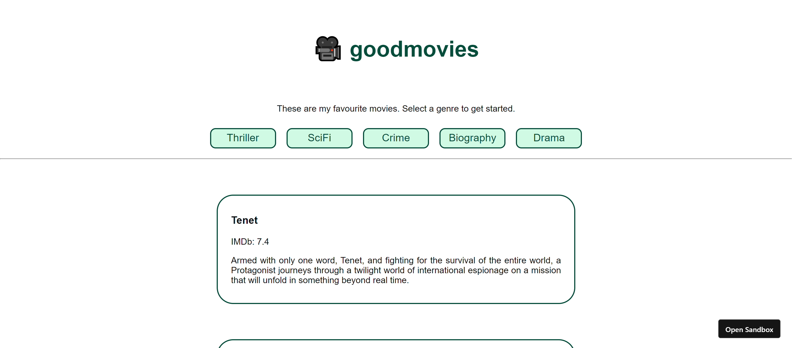

# Movies recommendation app

This is an app which displays my favourite movies, its rating and description based on selected genre.

## Overview

### Screenshot



### Links

- Live Site URL: [https://cut34.csb.app/](https://cut34.csb.app/)

## My process

### Built with

- React

### What I learned

Using map function to create an entire list from the data in an array.

```js
<ul>
  {movieDB[genre].map((movie) => {
    return (
      <li key={movie.name} className="card">
        <h3 className="card__title">{movie.name}</h3>
        <p className="card__rating">IMDb: {movie.imdb}</p>
        <p className="card__text">{movie.description}</p>
      </li>
    );
  })}
</ul>
```

## Author

- Twitter - [@DarshanDamre](https://twitter.com/DarshanDamre)
- LinkedIn - [Darshan Damre](https://www.linkedin.com/in/darshandamre/)
- Website - [Darshan Damre](https://darshandamre.netlify.app/)
